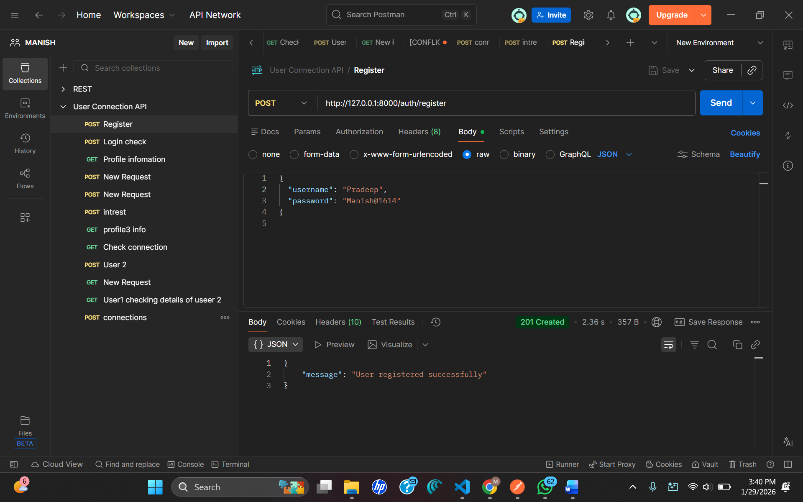
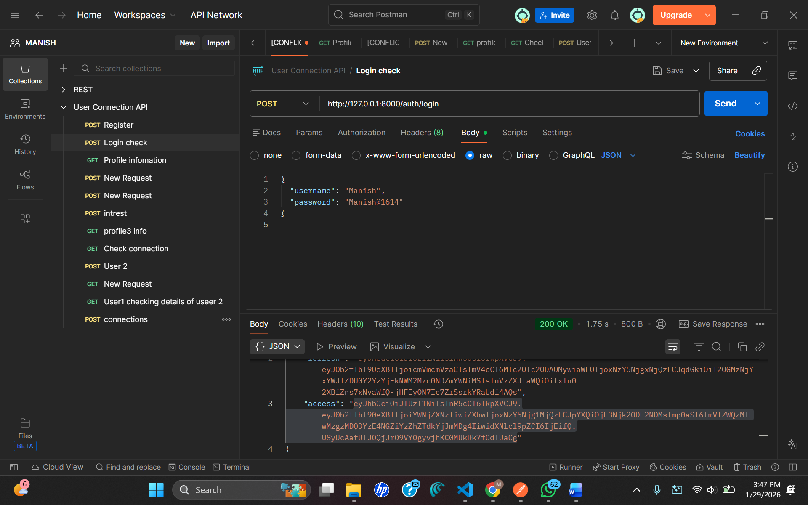
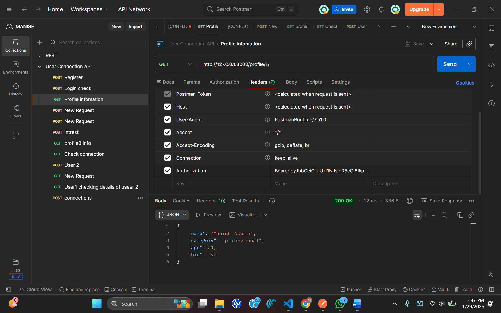
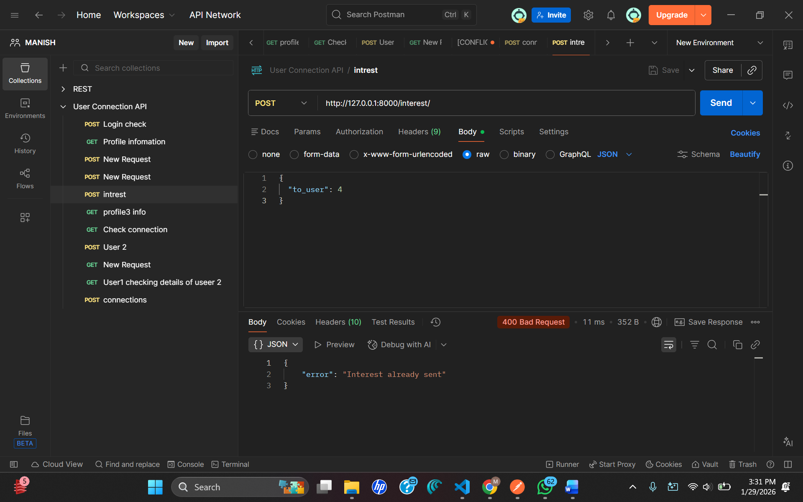
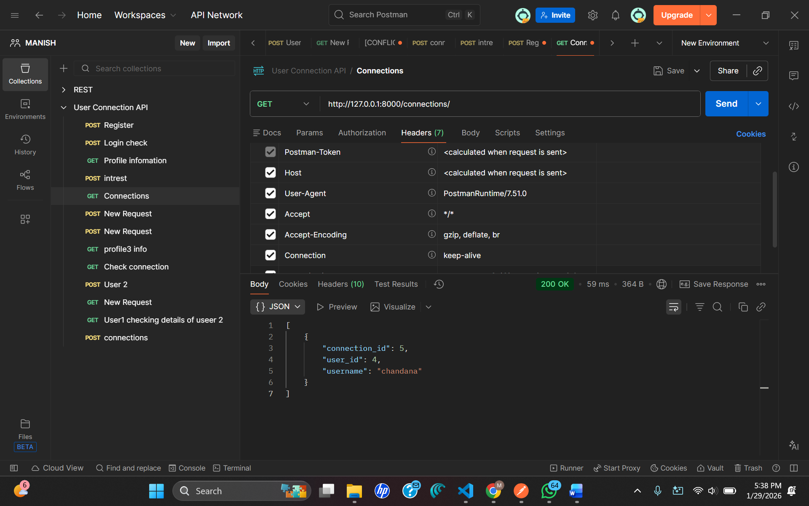
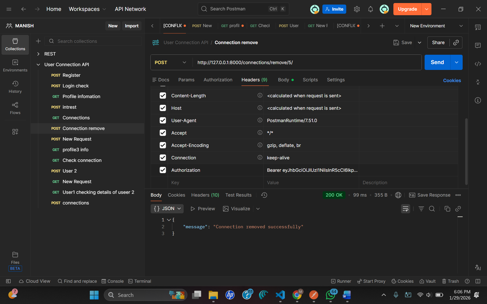

# 🔗 Mutual Connection System (Backend)

A secure backend system built with **Django**, **Django REST Framework**, and **JWT Authentication** that enables users to express interest, form mutual connections, and view profiles conditionally.

This system ensures:
- 🔐 Secure access using JWT
- 🤝 Mutual consent before connections
- 👁️ Controlled profile visibility

This project implements a Mutual Connection System backend using Django + Django REST Framework + JWT authentication.
Users can register, log in, create profiles, express interest in other users, form mutual connections, view connections conditionally, and remove connections.

The system ensures secure access, mutual consent, and controlled profile visibility.

1. Setup Steps
---------------
Prerequisites

>>Python 3.10+

>>Virtual Environment

>>Django

>>Django REST Framework

>>SimpleJWT

Installation Steps:-
-------------------------------
# Clone repository

cd project

# Create virtual environment
python -m venv .venv
source .venv/bin/activate  # Windows: .venv\Scripts\activate

# Install dependencies
pip install -r requirements.txt

# Apply migrations
python manage.py makemigrations
python manage.py migrate

# Create superuser (for admin & profiles)
python manage.py createsuperuser

# Run server
python manage.py runserver

#Server runs at:
------------------------------------

http://127.0.0.1:8000/

2. Database Schema Explanation
------------------------------------
User (Django Default)

>>id

>>username

>>password

>>email

#Profile:-
-----------------------------
| Field    | Type           |
| -------- | -------------- |
| user     | OneToOne(User) |
| name     | CharField      |
| age      | IntegerField   |
| category | CharField      |
| bio      | TextField      |

#Interest
---------------------------------
| Field      | Type             |
| ---------- | ---------------- |
| from_user  | ForeignKey(User) |
| to_user    | ForeignKey(User) |
| created_at | DateTime         |

#Connection
---------------------------------
| Field      | Type             |
| ---------- | ---------------- |
| sender     | ForeignKey(User) |
| receiver   | ForeignKey(User) |
| status     | accepted         |
| created_at | DateTime         |

3. How Mutual Connection Logic Works
--------------------------------------

3.1.User A sends interest to User B
--------------------------------

-Bash
-------> POST /interest/

3.2.Interest stored
------------------
    from_user = A
    to_user = B

3.3.User B sends interest back to User A
-----------------------------------------

->System checks:

Interest.objects.filter(
    from_user=B,
    to_user=A
).exists()

3.4.If mutual interest exists
---------------------------------
A Connection is automatically created

Status = accepted

✅ No manual approval needed
✅ Only mutual interest forms a connection

4. How Conditional Visibility Is Enforced
-----------------------------------------
Profile Visibility

A user can view another user's profile ONLY if:
->They are connected, OR
->It is their own profile

Code Logic :-
if request.user != profile.user and not Connection.objects.filter(
    sender=request.user, receiver=profile.user
).exists():
    return Response({"error": "Not allowed"})

🚫 No connection → No profile access
✅ Connection exists → Profile visible

5. Edge Cases Handled
------------------------------------------
✔ User cannot send interest to themselves
✔ Duplicate interest blocked
✔ Duplicate connections avoided
✔ Unauthorized users blocked (JWT required)
✔ Profile access blocked without connection
✔ Non-existent user IDs handled
✔ Connection deletion restricted to involved users

Example:-
-----------

{
  "error": "Interest already sent"
}

6. Improvements for Scale (Future Enhancements)
----------------------------------------------------

>>Pagination for connections list
>>Indexing on from_user & to_user
>>Redis caching for profile access
>>WebSockets for real-time connection updates
>>Soft delete for connections
>>Rate limiting interest requests
>>Background jobs for notifications
>>Database sharding for large user base

API Endpoints Summary
------------------------------------------------------

| Method | Endpoint                   | Purpose           |
| ------ | -------------------------- | ----------------- |
| POST   | `/auth/register`           | Register          |
| POST   | `/auth/login`              | Login             |
| GET    | `/profile/{id}`            | View profile      |
| POST   | `/interest/`               | Express interest  |
| GET    | `/connections/`            | List connections  |
| POST   | `/connections/remove/{id}` | Remove connection |

---

## 🖼️ API Testing Screenshots (Postman)

### 🔐 Register API

### 🔑 Login API

### 👤 View Profile API

### ❤️ Express Interest API

### 🤝 Connections API

*Submission Notes*

✔ All APIs tested using Postman
✔ Screenshots captured as proof
✔ JWT authentication enforced
✔ Assignment requirements fully met
## API Testing Screenshots (Postman)

### 🔐 Register API

### 🔑 Login API

### 👤 View Profile API

### ❤️ Express Interest API

### 🤝 Connections API

### 🗑️ Remove Connection API

